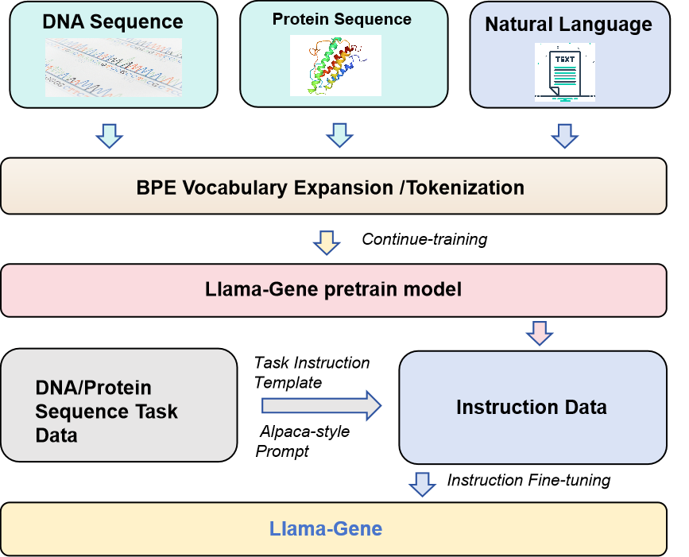
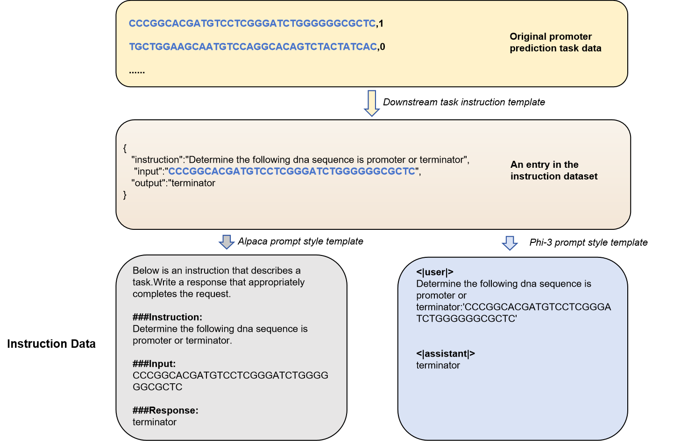

# llama-gene
A General-purpose Gene Task Large Language Model Based on Instruction Fine-tuning

# abstract
Building a general-purpose task model similar to ChatGPT has been an important research direction for gene large language models. Instruction fine-tuning is a key component in building ChatGPT, but existing instructions are primarily based on natural language. Natural language and DNA sequences have significant differences in tokenization and encoding. Therefore, constructing a multilingual model that can handle both natural language and DNA sequences is crucial for solving this problem.In this paper, we expand the capabilities of the LLaMA large language model to include gene language. This involves expanding the vocabulary using the Byte Pair Encoding (BPE) method, specifically tailored for DNA and protein sequences, and conducting further pre-training on these sequences. We then convert various downstream gene task data into a unified format for instruction fine-tuning and further fine-tune the model on this data.Our study demonstrates that a mixed model of gene and natural language, fine-tuned with instructions, achieves results comparable to the current state-of-the-art (SOTA) in tasks such as gene classification and gene sequence interaction. This provides a promising direction for building a unified large language model for gene tasks.

# brief of llama-gene
Since the original llama model has been trained primarily on English natural language text, we expanded the vocabulary and conducted further pre-training using DNA and protein sequences. On this basis, we converted various gene sequence tasks, including protein and DNA classification tasks, protein-protein interaction tasks, and protein-DNA correlation tasks, into consistent instruction data using different prompt templates. We then used this instruction data to fine-tune the pre-trained model, resulting in the llama-gene model. The process is illustrated in the following diagram:

# datasets
| period           | datasets                        | data size | data type         |
|------------------|---------------------------------|-----------|-------------------|
| BPE training     | multiple model organism genomes | 1G        | DNA               |
| BPE training     | UniProt [multispecies]          | 1G        | Protein sequence  |
| Continue training| multiple model organism genomes | 16G       | DNA               |
| Continue training| Swiss-Prot/TrEMBL               | 16G       | Protein sequence  |
| Continue training| s2orc/biology paper             | 16G       | Natural Language  |
| Instruction finetune| GLUE/convert                    | 100M      | DNA downstream    |
| Instruction finetune| lucaone/convert                 | 100M      | Protein downstream|
| Instruction finetune| UniProt function                | 300M      | Protein translation|

# Training Strategy
## llama base model
Given the usage rules for LLaMA, we are using by default the HF-format model converted from an early test version of LLaMA. If you need to test LLaMA 2 or LLaMA 3 and other official versions, you will need to apply on Hugging Face.

## Tokenization
We trained the vocabulary for DNA and protein sequences using BPE, then merged them into the original LLaMA vocabulary (32,000 tokens). Both the DNA and protein vocabularies consist of 30,000 words, resulting in a final vocabulary size of approximately 91,000 words.

step 1, train BEP dict

dna_model/build_sentence_dna_bpe.ipynb

step 2, merge dict

dna_model/merge_dna_eng_llama_dict.ipynb

see same code in dna_protein_model for mixed model.

## Pretraining
Due to the large number of parameters in LLaMA models, ranging from 7B to 405B, performing full-parameter continuous pre-training would be very costly. Therefore, we adopted the LoRA method for training, specifically using the PEFT framework from Hugging Face.  The parameter settings were referenced from the configuration of llama-chinese.

With this setup, approximately 10% of the parameters are being trained. On an 8-card L20 server, it takes about one week to complete training with 16GB of data.

run:
dna_model/run_pt.sh

see same code in dna_protein_model for mixed model.

## Instruction Fine-tuning
For fine-tuning, we used typical gene sequence analysis tasks and converted them into a fine-tuning data format for instruction tuning.

run:
dna_model/run_sft.sh

see same code in dna_protein_model for mixed model.

## llama-gene model

llama-dna pretrain model: https://huggingface.co/dnagpt/llama-dna 

llama-dna sft model:  https://huggingface.co/dnagpt/llama-dna-sft

llama-dna-protein pretrain model: https://huggingface.co/dnagpt/llama-gene

llama-dna-protein sft model:  https://huggingface.co/dnagpt/llama-gene-sft

